==================
Adicionar conteúdo
==================

Página para adicionar conteúdo no NIRA.

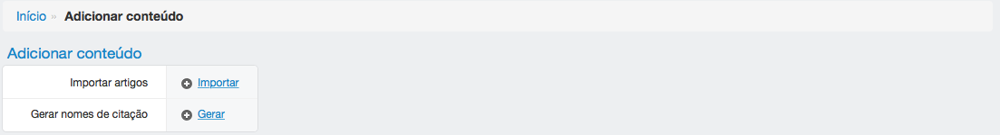

*******************************
Criar/Atualizar nome de citação
*******************************

Clique nessa sessão para criar e/ou atualizar os nomes de citação de todas as pessoas cadastradas no sistema. Supondo
uma pessoa com o nome João Carlos da Silva, o sistema irá gerar os seguintes nomes de citação: Silva, JC; Silva, João
Carlos; Silva, João C; da Silva, JC; da Silva, João Carlos e da Silva, João C. O nome de citação padrão neste exemplo
seria Silva, JC.

Estes dados são utilizados principalmente quando artigos são importados do Google Scholar, por dois motivos. Primeiro
para criar um padrão nos nomes de citação que irão aparecer no relatório, segundo para tentar encontrar autores de
artigos na base de dados de pessoas cadastradas no sistema.

****************
Importar artigos
****************

O Google Scholar fornece um meio de exportar artigos com a extensão *.ris*. Basta selecionar os artigos e clicar em
*Exportar > RefMan*.

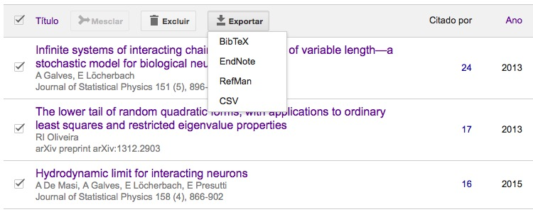

Exemplo de arquivo no formato *.ris*:

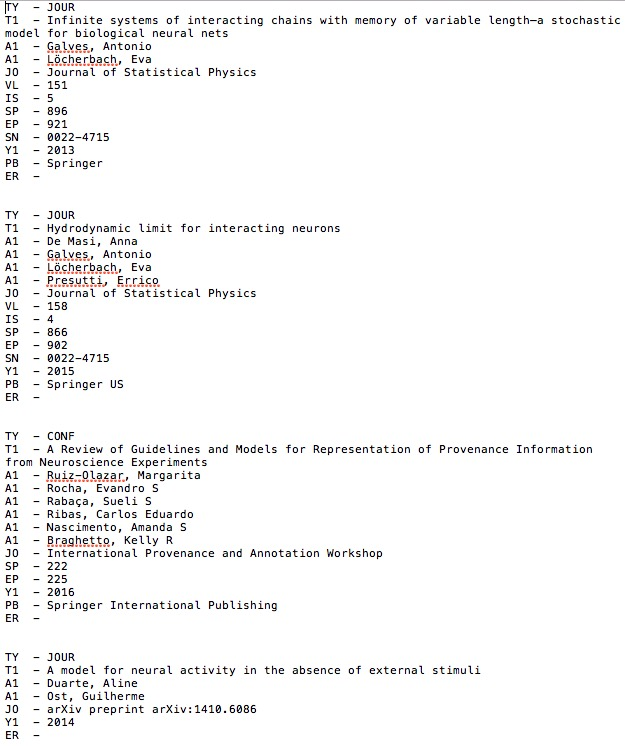

Para adicionar artigos faça o upload de um arquivo no formato *.ris* e clique em "Enviar".

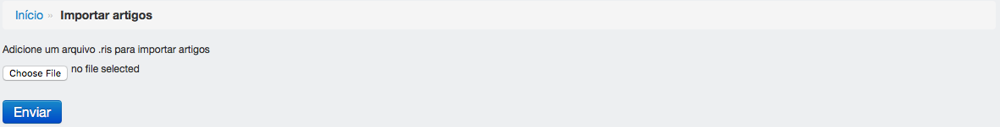

O processo de importação de artigos é realizado em 6 passos:

Passo 1: cadastrar os periódicos encontrados no arquivo *.ris*. Selecione os periódicos e clique em "Adiconar
periódicos". Após adicionar os periódicos, clique em "Próximo" para seguir para o próximo passo.

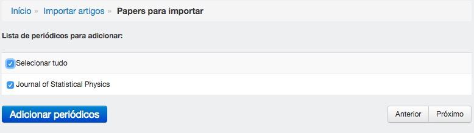

Passo 2: cadastrar eventos (congressos, conferências, etc). Este processo não está automatizado, portanto é preciso
cadastrá-los manualmente. Faça esse cadastro antes de seguir para o próximo passo. Após o cadastro, clique em "Próximo"
para seguir para o próximo passo.

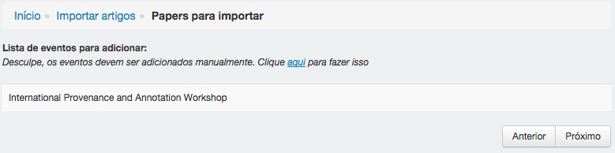

Passo 3: cadastrar artigos publicado em periódicos. Selecione os artigos e clique em "Adicionar papers". Após adicionar
os artigos, clique em "Próximo" para seguir para o próximo passo.

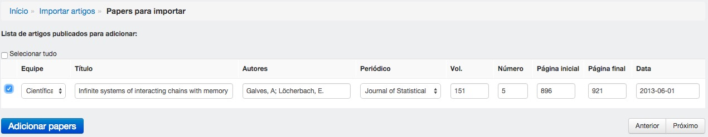

Passo 4: cadastrar artigos da plataforma arXiv. Selecione os artigos e clique em "Adicionar papers". Após adicionar os
artigos, clique em "Próximo" para seguir para o próximo passo.

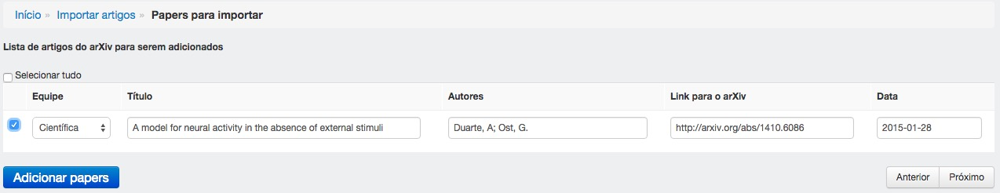

Passo 5: cadastrar artigos apresentados em eventos (congressos, conferências, etc). Selecione os artigos e clique em
"Adicionar papers". Após adicionar os artigos, clique em "Próximo" para seguir para o próximo passo.

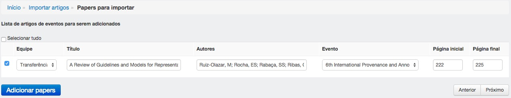

Passo 6: atualizar artigos. Isto acontece quando o NIRA encontra no arquivo *.ris* um artigo publicado em algum
periódico que tenha o mesmo título de um artigo cadastrado em sua base de dados e que ainda não esteja com o status
publicado.

Selecione os artigos e clique em "Atualizar artigos". Após a atualização, clique em "Finalizar" para encerrar a
importação.

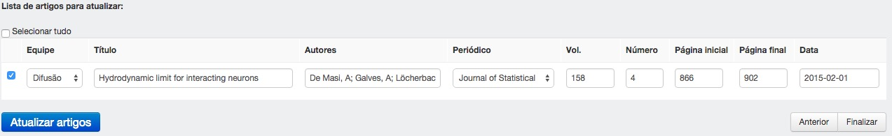

É possível ver os artigos adicionados em *Resultados de pesquisa > Artigos*:

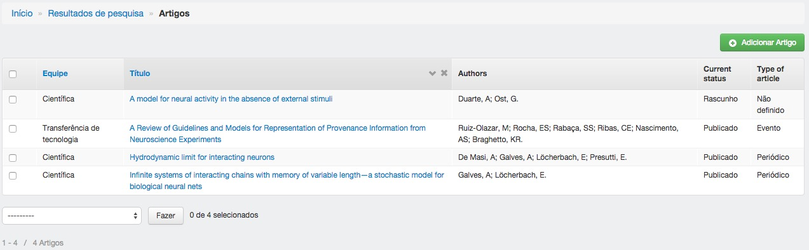