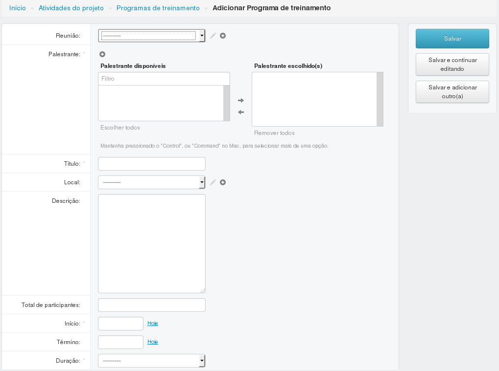
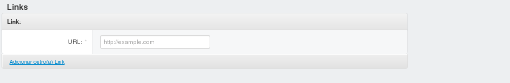
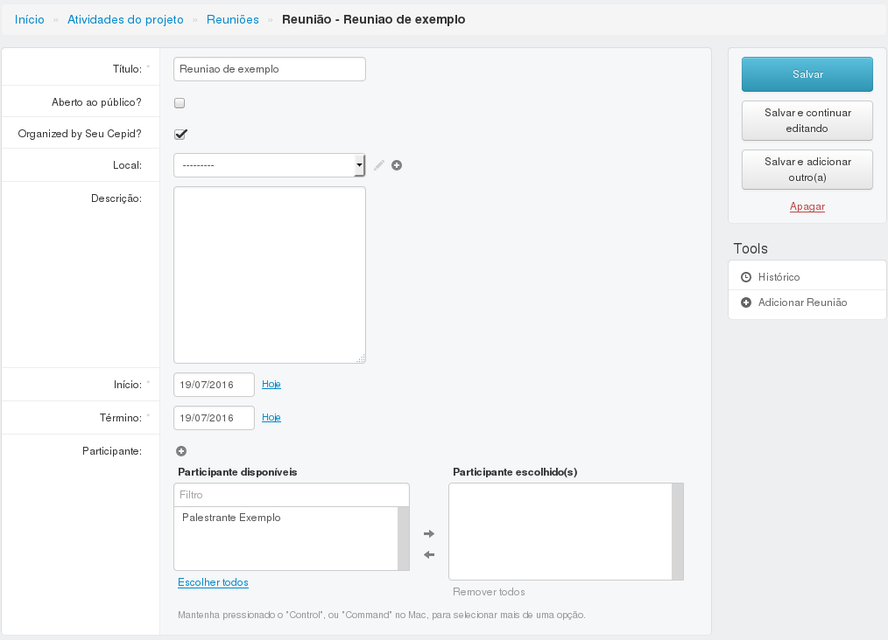
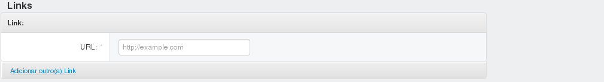
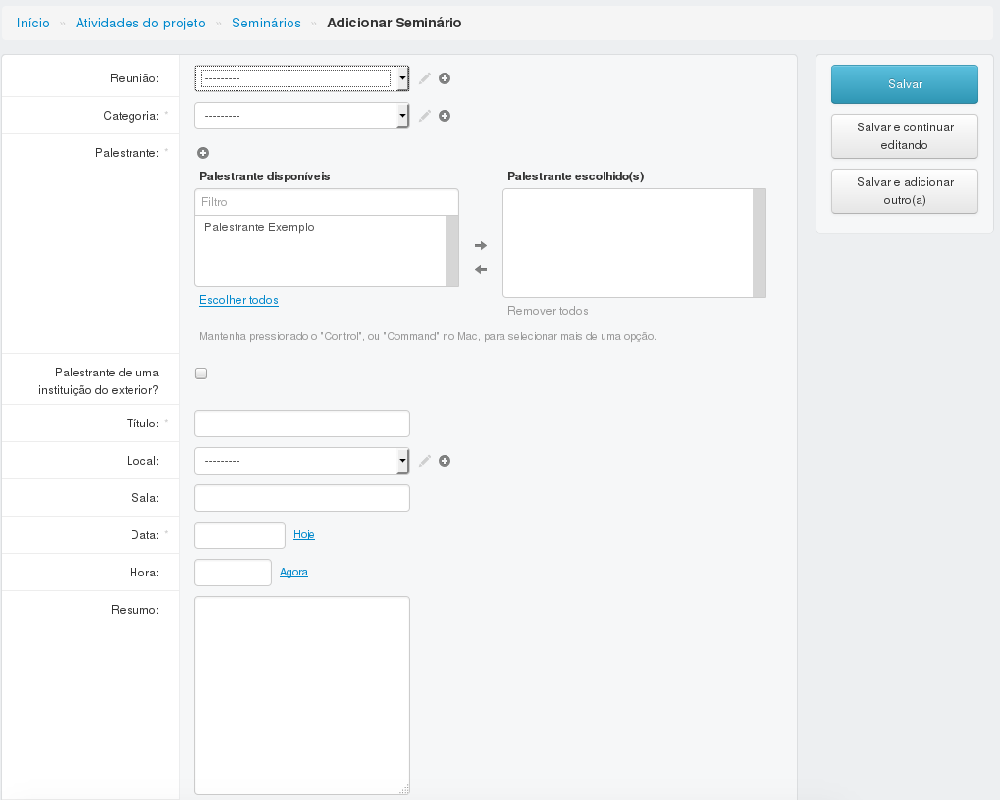
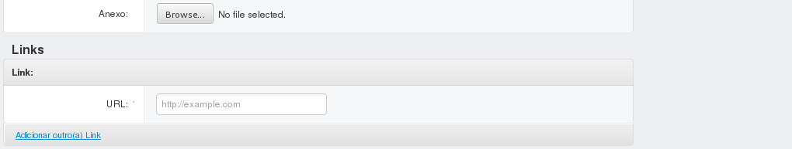
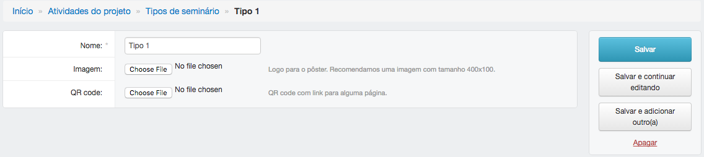

=====================
Atividades de projeto
=====================

O módulo atividades do projeto recebe as informações referentes aos eventos, seminários e treinamentos que foram
realizados pelo CEPID.

.. image:: imagens/atividades.png

************************
Programas de treinamento
************************

----------------------------------------------
Adicionar ou editar um programa de treinamento
----------------------------------------------

Para adicionar ou editar um programa de treinamento, preencha os campos e clique em salvar. Um programa de treinamento
pode fazer parte de uma reunião (evento, congresso, conferência). Se este for o caso, primeiro
`crie a reunião <../atividades_projeto/main.html#reunioes>`_, depois selecione a reunião criada no item "Reunião".

:Campos obrigatórios:
	Palestrante, título e data de início

********
Reuniões
********

-------------------------------
Adicionar ou editar uma reunião
-------------------------------

Para adicionar ou editar uma reunião (evento, congresso, conferência), preencha os campos e clique em salvar.

:Campos obrigatórios:
	Título, data de início e data de término

**********
Seminários
**********

--------------------------------
Adicionar ou editar um seminário
--------------------------------

Para adicionar ou editar um seminário, preencha os campos e clique em salvar. Da mesma forma que um programa de
treinamento, um seminário também pode fazer parte de uma reunião (evento, congresso, conferência). Se este for o caso,
primeiro `crie a reunião <../atividades_projeto/main.html#reunioes>`_, depois selecione a reunião criada no item
"Reunião".

:Campos obrigatórios:
	Categoria, palestrante, título e data

******************
Tipos de seminário
******************

------------------------------
Adicionar um tipo de seminário
------------------------------

Para adicionar um tipo de seminário, preencha o nome e clique em salvar.

:Campos obrigatórios:
	Nome