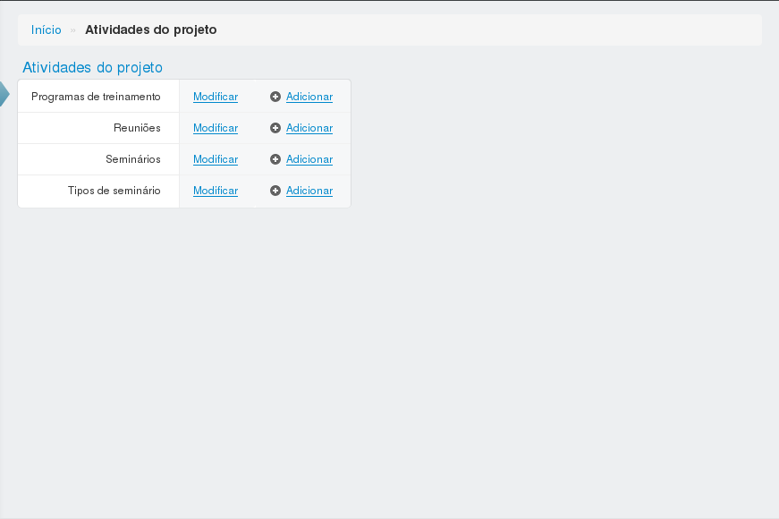

=====================
Atividades de projeto
=====================

Página detalhando as atividades de projeto.

************************
Programas de treinamento
************************

----------------------------------------------
Adicionar ou editar um programa de treinamento
----------------------------------------------

Para adicionar ou editar um programa de treinamento, preencha os campos e clique em salvar.

.. image:: imagens/add_pgm_1.png

:Campos obrigatórios:
	Palestrante, título e data de início

********
Reuniões
********

-------------------------------
Adicionar ou editar uma reunião
-------------------------------

Para adicionar ou editar uma reunião, preencha os campos e clique em salvar.

:Campos obrigatórios:
	Título, data de início e data de término

**********
Seminários
**********

--------------------------------
Adicionar ou editar um seminário
--------------------------------

Para adicionar ou editar um seminário, preencha os campos e clique em salvar.

.. image:: imagens/seminario_2.png

:Campos obrigatórios:
	Categoria, palestrante, título e data

******************
Tipos de seminário
******************

------------------------------
Adicionar um tipo de seminário
------------------------------

Para adicionar um tipo de seminário, preencha o nome e clique em salvar.

:Campos obrigatórios:
	Nome