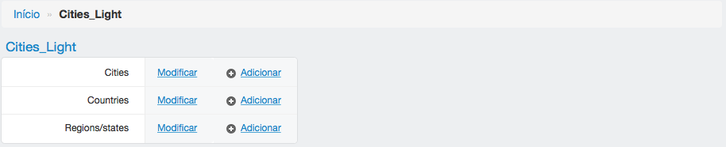
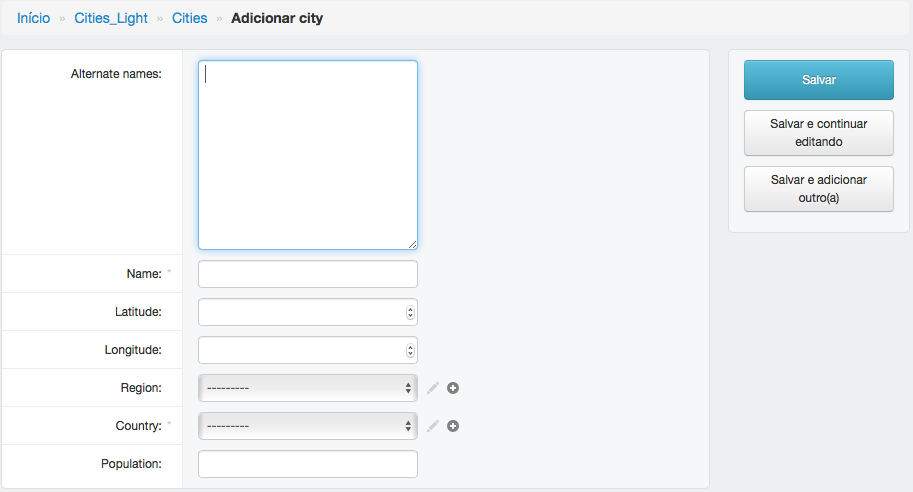
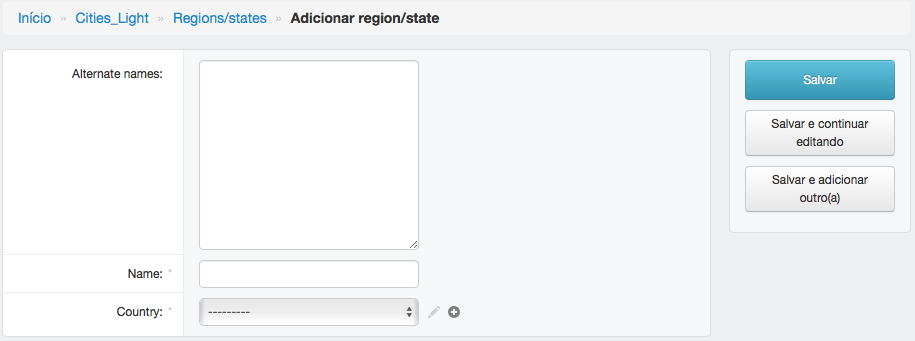

=======
Cidades
=======

Informações sobre a página de cidades.

******
Cities
******

---------------------------------
Adicionar ou modificar uma cidade
---------------------------------

Para adicionar ou editar um programa de treinamento, preencha os campos e clique em salvar.

:Campos obrigatórios:
	Nome e país

*********
Countries
*********

------------------------------
Adicionar ou modificar um país
------------------------------

Para adicionar ou editar um país, preencha os campos e clique em salvar.

:Campos obrigatórios:
	Nome e continente

**************
Regions/states
**************

-----------------------------
Adicionar ou editar um estado
-----------------------------

Para adicionar ou editar um estado, preencha os campos e clique em salvar.

:Campos obrigatórios:
	Nome e país