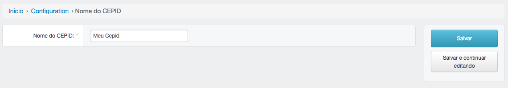
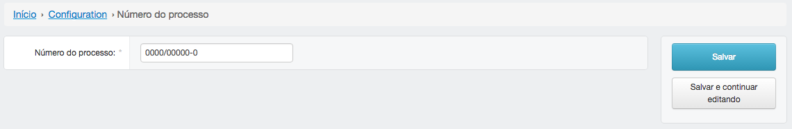

===================
Configurando o NIRA
===================

*************
Nome do CEPID
*************

Aqui você deve preencher com o nome do seu CEPID. Esse nome pode ser usado em algum relatório.

******************
Número do processo
******************

Aqui você precisa colocar o número de processo do seu CEPID. Esse número é o padrão
que fica definido para a geração do Anexo 5 da FAPESP.

