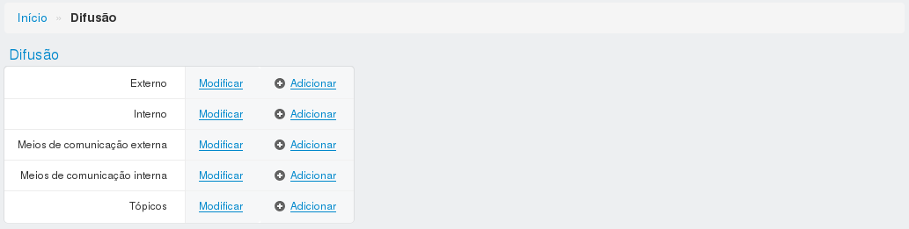
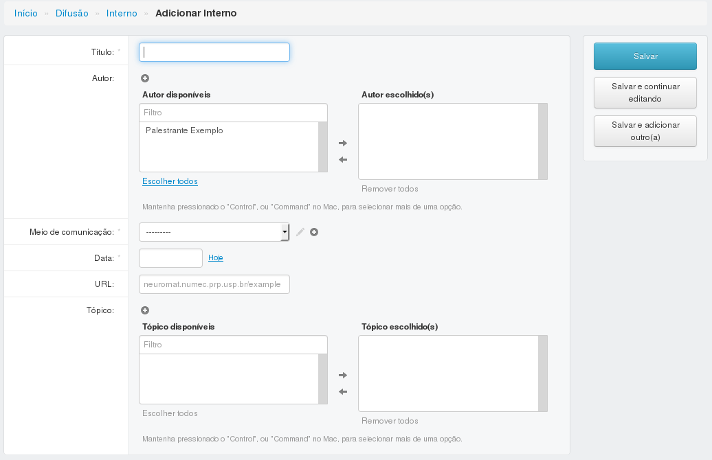
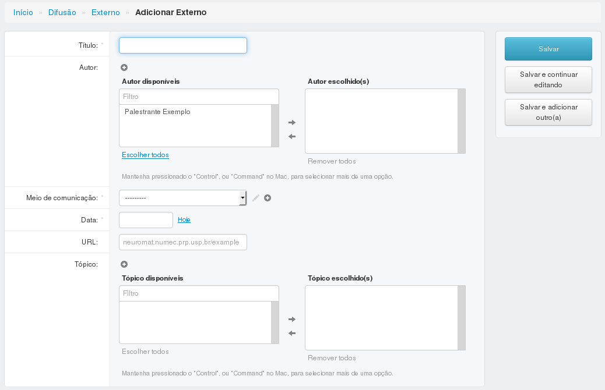
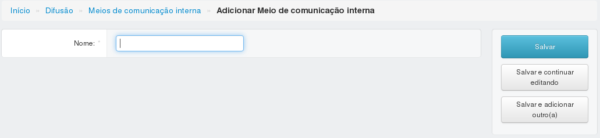
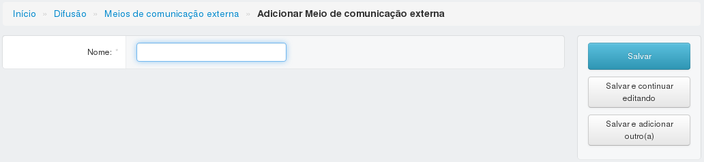
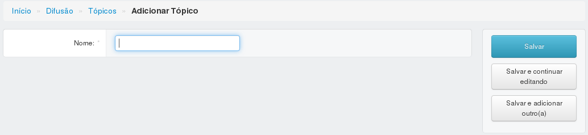

=======
Difusão
=======

Informações sobre a página de difusão.

***************
Difusão interna
***************

---------------------------------------
Adicionar ou editar uma difusão interna
---------------------------------------

Para adicionar ou editar uma difusão interna, preencha os campos e clique em salvar.

:Campos obrigatórios:
	Título, meio de comunicação e data

***************
Difusão externa
***************

---------------------------------------
Adicionar ou editar uma difusão externa
---------------------------------------

Para adicionar ou editar uma difusão externa, preencha os campos e clique em salvar.

:Campos obrigatórios:
	Título, meio de comunicação e data

****************************
Meios de comunicação interna
****************************

--------------------------------------------------
Adicionar ou editar um meio de comunicação interna
--------------------------------------------------

Para adicionar um meio de comunicação interna, preencha o campo e clique em salvar.

:Campos obrigatórios:
	Nome

****************************
Meios de comunicação externa
****************************

--------------------------------------------------
Adicionar ou editar um meio de comunicação externa
--------------------------------------------------

Para adicionar um meio de comunicação externa, preencha o campo e clique em salvar.

:Campos obrigatórios:
	Nome

******
Tópico
******

-----------------------------
Adicionar ou editar um tópico
-----------------------------

Para adicionar ou editar um tópico, preencha o campo e clique em salvar.

:Campos obrigatórios:
	Nome

