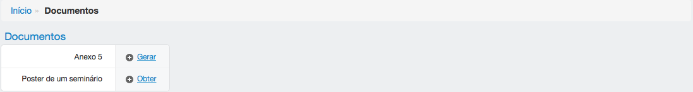
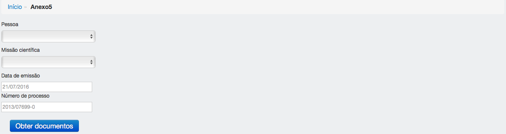
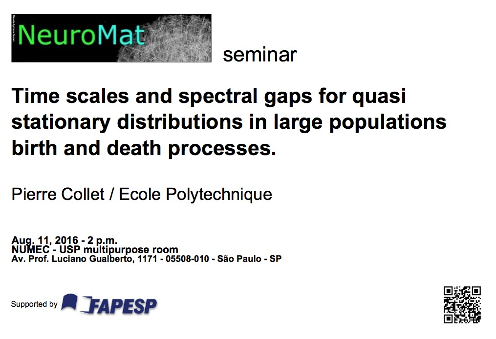

==========
Documentos
==========

Com base nas diárias cadastradas (ver `Diárias <../missao_cientifica/main.html#diarias>`_) o NIRA
pode gerar o documento "Anexo 5" da FAPESP. O NIRA também pode gerar um poster de divulgação de um seminário com base
nos seminários cadastrados (ver `Seminários <../atividades_projeto/main.html#seminarios>`_).

****************
FAPESP - Anexo 5
****************

Clique nessa sessão para obter o documento Anexo 5 de uma missão científica para a FAPESP.

:Observação importante:
    Para gerar este documento, você deve configurar alguma pessoa como pesquisadora principal (ver `Configurações <../configuracao/main.html>`_), o nome dessa pessoa aparece no Anexo 5.

:Campos opcionais:
    A data de emissão será a data do dia em que a ação executada caso nada seja preenchido.

    O número do processo usado é o padrão do seu sistema (ver `Configurações <../configuracao/main.html>`_), você pode optar por digitar outro número.

**********************
Pôster de um seminário
**********************

Clique nessa sessão para obter um pôster de seminário.

Escolha o palestrante, o seminário desejado e clique em obter pôster.

O pôster terá no canto superior esquerdo a imagem determinada para o tipo do seminário (ver `Tipo de seminário <../atividades_projeto/main.html#tipos-de-seminario>`_).

Exemplo de pôster com uma imagem para o tipo de seminário:

