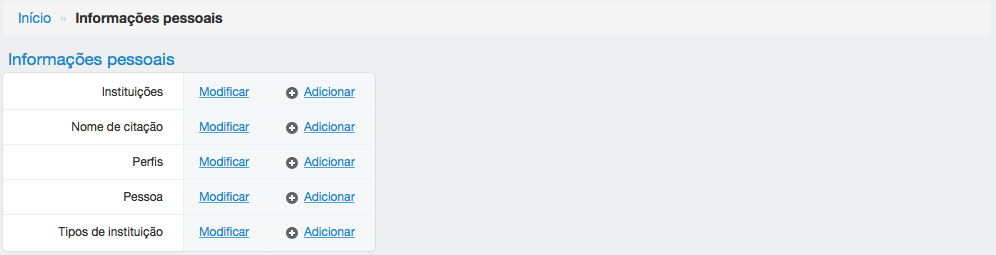
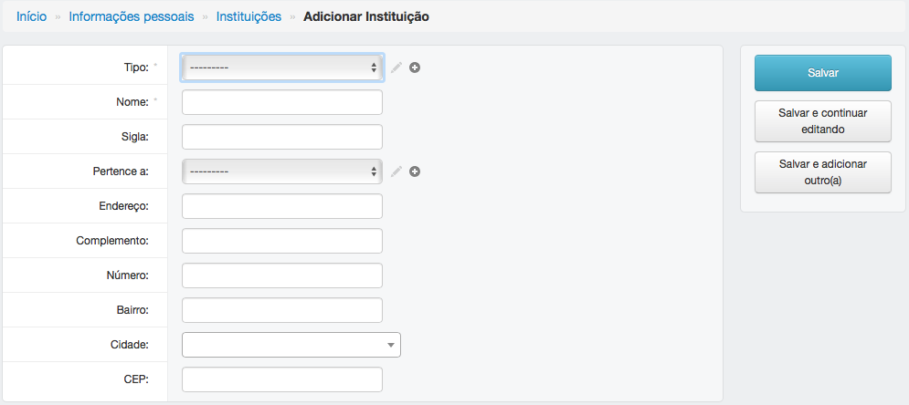
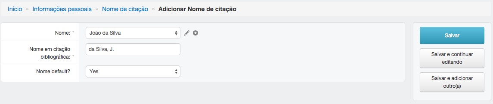
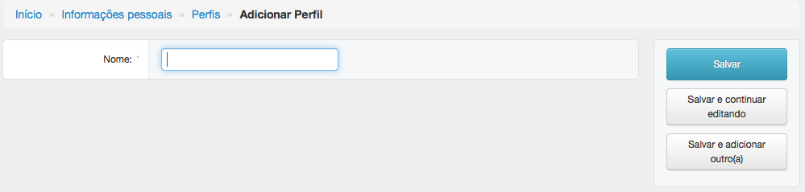
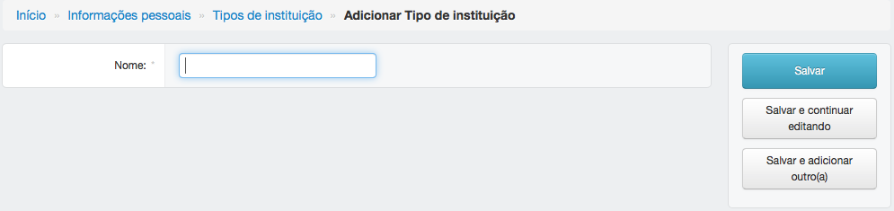

====================
Informações pessoais
====================

O módulo informações pessoais é utilizado para armazenar dados dos pesquisadores envolvidos no projeto e de suas
intituições.

************
Instituições
************

--------------------------------
Adicionar ou editar instituições
--------------------------------

Para adicionar uma instituição, preencha os campos obrigatórios e clique em salvar.

Para editar uma instituição já criada, clique no nome, edite os campos e clique em salvar.

:Campos obrigatórios:
    Tipo e nome

***************
Nome de citação
***************

--------------------------------------
Adicionar ou editar um nome de citação
--------------------------------------

Nomes de citações podem ser gerados automaticamente por meio do link *Adicionar conteúdo > Criar/Atualizar nome de
citação*. Veja mais em `Adicionar conteúdo <../adicionar_conteudo/main.html>`_.

Para adicionar um nome de citação, preencha os campos obrigatórios e clique em salvar.

Para editar um nome de citação, clique no nome, edite os campos e clique em salvar.

:Campos obrigatórios:
    Nome e nome em citação bibliográfica

******
Perfis
******

-----------------------------
Adicionar ou editar um perfil
-----------------------------

Para adicionar um perfil, preencha os campos obrigatórios e clique em salvar.

Para editar um perfil, clique no nome, edite os campos e clique em salvar.

:Campos obrigatórios:
    Nome

******
Pessoa
******

------------------------------
Adicionar ou editar uma pessoa
------------------------------

Para adicionar uma pessoa, preencha os campos obrigatórios e clique em salvar.

Para editar uma pessoa, clique no nome, edite os campos e clique em salvar.

.. image:: imagens/pessoa.png

:Campos obrigatórios:
    Nome completo

********************
Tipos de instituição
********************

------------------------------------------
Adicionar ou editar um tipo de instituição
------------------------------------------

Para adicionar um tipo de instituição, preencha os campos obrigatórios e clique em salvar.

Para editar um tipo de instituição, clique no nome, edite os campos e clique em salvar.

:Campos obrigatórios:
    Nome