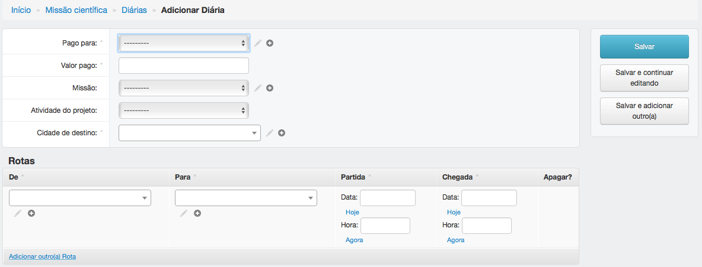

=================
Missão científica
=================

Informações sobre a página de missão científica.

*******
Diárias
*******

---------------------------
Adicionar ou editar diárias
---------------------------

Para adicionar diárias, preencha os campos obrigatórios e clique em salvar.

Para editar diárias, clique em ID, edite os campos e clique em salvar.

:Campos obrigatórios:
    Pago para, rotas, valor pago e cidade de destino

**************************
Tipos de missão científica
**************************

----------------------------------------------
Adicionar ou editar tipos de missão científica
----------------------------------------------

Para adicionar tipos de missão científica, preencha o campo obrigatório e clique em salvar.

Para editar tipos de missão científica, clique no título da missão, edite e clique em salvar.

:Campos obrigatórios:
    Missão científica