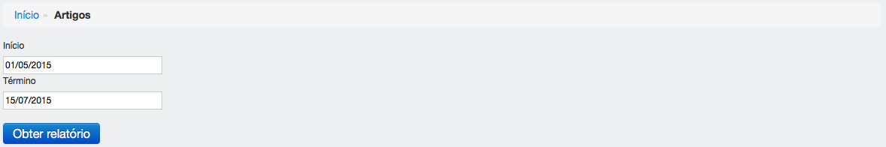

==========
Relatórios
==========

Informações sobre os relatórios que podem ser gerados no NIRA.

********************
Trabalhos acadêmicos
********************

---------------------------------------
Obter relatório de trabalhos acadêmicos
---------------------------------------

Para obter o relatório de trabalhos acadêmicos em um determinado período, preencha as datas de início e término e clique em obter relatório.

*******
Artigos
*******

--------------------------
Obter relatório de artigos
--------------------------

Para obter o relatório de artigos dentro de um determinado período, preencha as datas de início e término e clique em obter relatório.

********
Difusões
********

---------------------------
Obter relatório de difusões
---------------------------

Para obter o relatório de difusões de um determinado tipo dentro de um determinado período, selecione o tipo, preencha as datas de início e término e clique em obter relatório.

.. image:: imagens/difusoes.png

********
Reuniões
********

---------------------------
Obter relatório de reuniões
---------------------------

Para obter o relatório de reuniões dentro de um determinado período, selecione se eram abertas ao público, preencha as datas de início e término e clique em obter relatório.

.. image:: imagens/reunioes.png

:Campos obrigatórios:

*******************
Missões científicas
*******************

--------------------------------------
Obter relatório de missões científicas
--------------------------------------

Para obter o relatório de missões científicas dentro de um determinado período, preencha as datas de início e término e clique em obter relatório.

.. image:: imagens/missoes_cientificas.png

**********
Seminários
**********

-----------------------------
Obter relatório de seminários
-----------------------------

Para obter o relatório de seminários de uma determinada categoria em um determinado período, selecione se a categoria, preencha as datas de início e término e clique em obter relatório.

.. image:: imagens/seminarios.png

************************
Programas de treinamento
************************

-------------------------------------------
Obter relatório de programas de treinamento
-------------------------------------------

Para obter o relatório de programas de treinamento em determinado período, preencha as datas de início e término e clique em obter relatório.

.. image:: imagens/programas_treinamento.png
