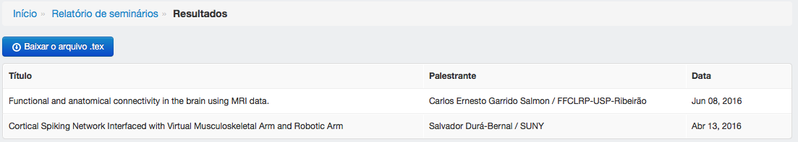

==========
Relatórios
==========

Os relatórios apresentam as informações cadastradas no sistema em determinado período e podem ser exportados para o
LaTeX.

.. image:: imagens/relatorios.png

********************
Trabalhos acadêmicos
********************

---------------------------------------
Obter relatório de trabalhos acadêmicos
---------------------------------------

Para obter o relatório de trabalhos acadêmicos em um determinado período, preencha as datas de início e término e clique
 em obter relatório.

.. image:: imagens/trabalhos_academicos.png

*******
Artigos
*******

--------------------------
Obter relatório de artigos
--------------------------

Para obter o relatório de artigos dentro de um determinado período, preencha as datas de início e término e clique em
obter relatório.

.. image:: imagens/artigos.png

Para o período de 01/05/2015 - 15/08/2016, o começo do relatório de artigos apresentado é o seguinte:

********
Difusões
********

---------------------------
Obter relatório de difusões
---------------------------

Para obter o relatório de difusões de um determinado tipo dentro de um determinado período, selecione o tipo, preencha
as datas de início e término e clique em obter relatório.

Para o período de 01/07/2016 - 31/07/2016, o relatório de difusões apresentado é o seguinte:

********
Reuniões
********

---------------------------
Obter relatório de reuniões
---------------------------

Para obter o relatório de reuniões dentro de um determinado período, escolha uma resposta relativo ao tópico "aberto ao
público, preencha as datas de início e término e clique em obter relatório.

Um relatório de reuniões para o período de 01/11/2015 - 31/11/2015 é o seguinte:

*******************
Missões científicas
*******************

--------------------------------------
Obter relatório de missões científicas
--------------------------------------

Para obter o relatório de missões científicas dentro de um determinado período, preencha as datas de início e término e
clique em obter relatório.

O resultado de missões científicas para o período 01/07/2016 - 31/07/2016 é:

**********
Seminários
**********

-----------------------------
Obter relatório de seminários
-----------------------------

Para obter o relatório de seminários de uma determinada categoria em um determinado período, selecione a categoria,
preencha as datas de início e término e clique em obter relatório.

O relatório para o período 01/01/2016 - 30/06/2016 é:

************************
Programas de treinamento
************************

-------------------------------------------
Obter relatório de programas de treinamento
-------------------------------------------

Para obter o relatório de programas de treinamento em determinado período, preencha as datas de início e término e
clique em obter relatório.

.. image:: imagens/programas_treinamento.png

O relatório de programas de treinamento para o período 01/01/2016 - 31/01/2016 é:

***********************************
Obtendo relatórios no formato LaTeX
***********************************

Ao obter um relatório no NIRA, você tem a opção de baixar um relatório no formato *.tex*

Para isso, clique no botão *Baixar o arquivo .tex* na página de resultado do relatório.

O arquivo baixado pode ser importado em um outro arquivo LaTeX fazendo::

    \input{nome_do_arquivo_baixado}

