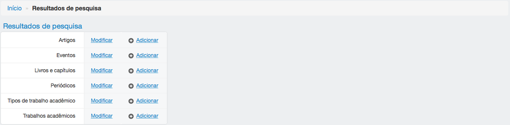
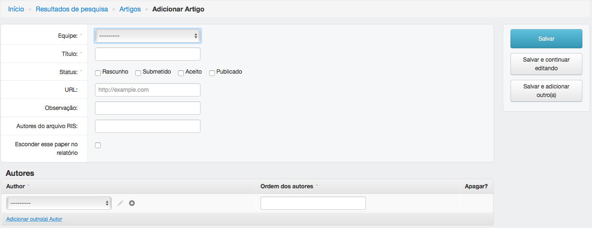
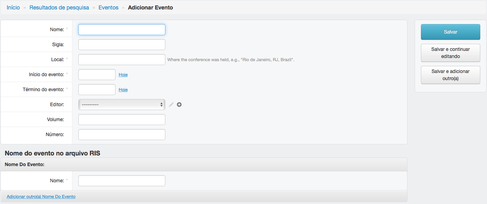
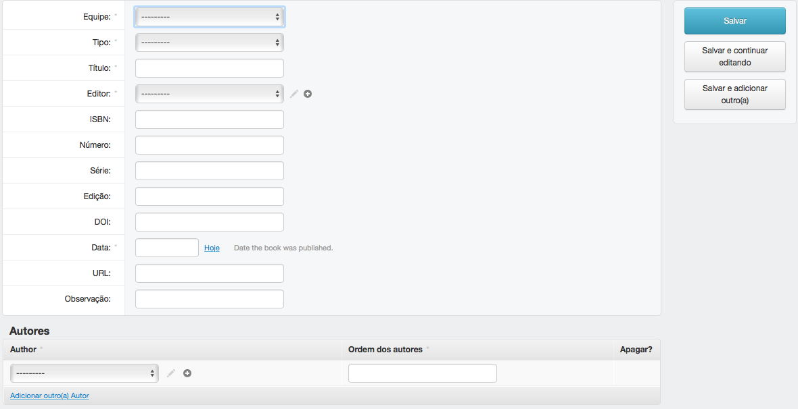
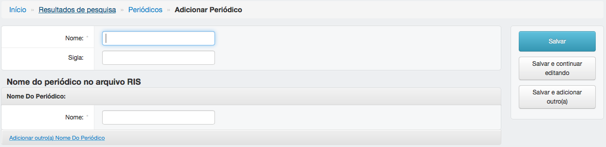
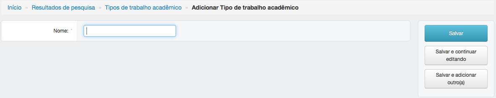
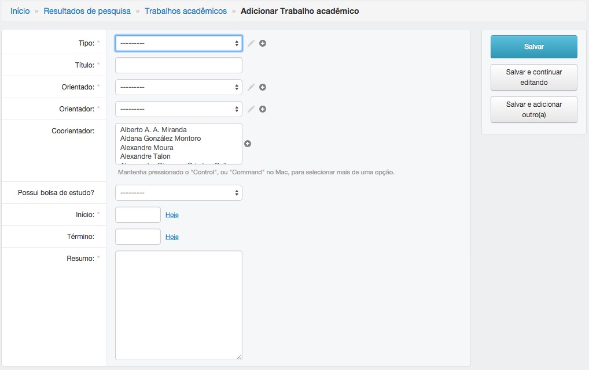

======================
Resultados de pesquisa
======================

O módulo resultados de pesquisa armazena informações sobre artigos, livros e trabalhos acadêmicos produzidos pelo CEPID.

*******
Artigos
*******

---------------------------
Adicionar ou editar artigos
---------------------------

Artigos podem ser importados do Google Scholar. Consulte o item `Adicionar conteúdo
<../adicionar_conteudo/main.html#importar-artigos>`_ para obter mais informações.

Para adicionar um artigo, preencha os campos obrigatórios e clique em salvar.

Para editar um artigo, clique no título, edite os campos e clique em salvar.

:Campos obrigatórios:
    Equipe, título e status

*******
Eventos
*******

------------------------------------------------------------
Adicionar ou editar um evento (congresso, conferência, etc.)
------------------------------------------------------------

Para adicionar um evento, preencha os campos obrigatórios e clique em salvar.

Para editar um evento, clique no nome, edite os campos e clique em salvar.

:Campos obrigatórios:
    Nome, local, data de início e data de término

***************************
Livros e capítulos de livro
***************************

--------------------------------------
Adicionar ou editar livros e capítulos
--------------------------------------

Para adicionar livros e capítulos, preencha os campos obrigatórios e clique em salvar.

Para editar livros e capítulos, clique no nome, edite os campos e clique em salvar.

:Campos obrigatórios:
    Equipe, tipo, titulo, editor e data

**********
Periódicos
**********

------------------------------
Adicionar ou editar periódicos
------------------------------

Para adicionar periódicos, preencha os campos obrigatórios e clique em salvar.

Para editar periódicos, clique no nome, edite os campos e clique em salvar.

:Campos obrigatórios:
    Nome

***************************
Tipos de trabalho acadêmico
***************************

----------------------------------------------
Adicionar ou editar tipos de traalho acadêmico
----------------------------------------------

Para adicionar tipos de trabalho acadêmico, preencha os campos obrigatórios e clique em salvar.

Para editar tipos de trabalho acadêmico, clique no nome, edite os campos e clique em salvar.

:Campos obrigatórios:
    Nome

********************
Trabalhos acadêmicos
********************

----------------------------------------
Adicionar ou editar trabalhos acadêmicos
----------------------------------------

Para adicionar trabalhos acadêmicos, preencha os campos obrigatórios e clique em salvar.

Para editar trabalhos acadêmicos, clique no nome, edite os campos e clique em salvar.

:Campos obrigatórios:
    Tipo, título, orientado, orientador, resumo e data de início

