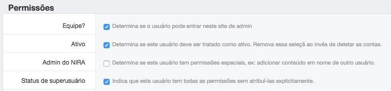

-------------
Para usuários
-------------

O NIRA pode funcionar com diferentes perfis para acesso ao sistema. Durante a fase de instalação, foi criado um usuário
com status de “superusuário”. Este usuário tem permissão para executar qualquer operação no sistema. As permissões de
um usuário podem ser vistas em Usuários > Nome do usuário.

Todo usuário com permissão de acesso ao NIRA deve estar com os itens "Equipe?" e "Ativo" habilitados. O item
"Admin do NIRA" permite que o usuário insira informações em nome de outros pesquisadores.

Os usuários que não possuem o status de “superusuário” habilitado devem receber permissões de acesso ao sistema de
forma manual. É possível criar permissões de acesso individuais ou para um grupo de usuários. Informações sobre como
criar permissões para um grupo de usuários podem ser vistas no item `Grupos <grupos/main.html>`_

.. toctree::
   :maxdepth: 2

   atividades_projeto/main.rst
   disseminacao/main.rst
   info_pessoal/main.rst
   resultados_pesquisa/main.rst
   missao_cientifica/main.rst
   relatorios/main.rst
   adicionar_conteudo/main.rst
   documentos/main.rst
   cidades/main.rst
   usuarios/main.rst
   grupos/main.rst