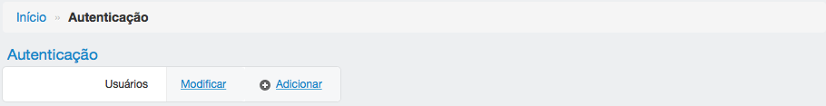
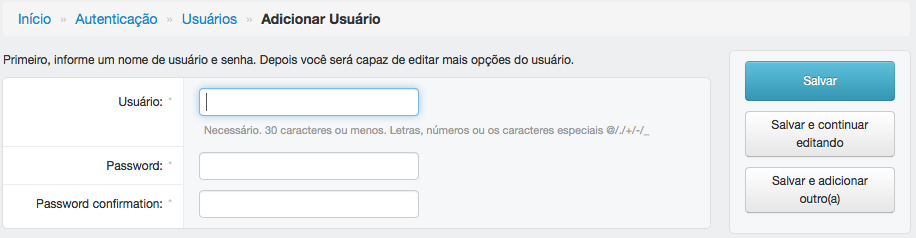

========
Usuários
========

Nesta tela é possível adicionar um novo usuário ou alterar as configurações de um usuário já cadastrado.

---------------------
Adicionar um usuário
---------------------

Para adicionar um usuário, no menu Autenticação clique em "Adicionar", depois preencha os campos e clique em salvar.

:Campos obrigatórios:
	Usuário, senha e confirmação de senha

------------------
Alterar um usuário
------------------

Para alterar as configurações de um usuário, no menu Autenticação clique em "Modificar", depois clique no nome do
usuário desejado.

As configurações do usuário são exibidas nesta tela:

Todo usuário com permissão de acesso ao NIRA deve estar com os itens "Equipe?" e "Ativo" habilitados. O item
"Admin do NIRA" permite que o usuário insira informações em nome de outros pesquisadores.

É possível criar permissões de acesso de forma individual, ou seja, para um único usuário, ou para um grupo de usuários.
Para atribuir permissões de forma individual utilize o item "permissões do usuário". Este item possui dois combos. Na
esquerda são mostrados as "permissões disponíveis para o usuário". Escolha as permissões desejadas. Utilizando
as setas, mova estas permissões para o combo "permissões escolhida(s) para o usuário" e clique em salvar. Informações
sobre como criar permissões para um grupo de usuários podem ser vistas no item `Grupos <../grupos/main.html>`_.

Os dados pessoais de um usuário do sistema são cadastrados no item `Pessoa <../info_pessoal/main.html#pessoa>`_. Depois
de criar a pessoa, utilize o item "Perfil do usuário" para ligar o usuário a seus dados pessoais.
